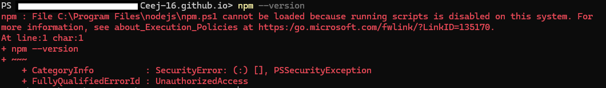
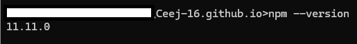
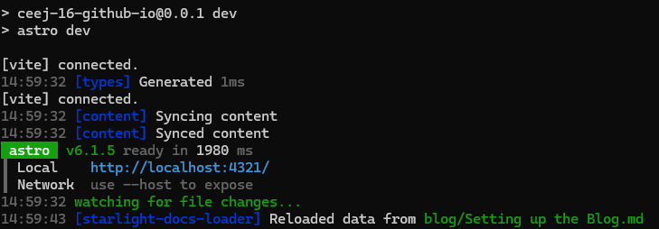
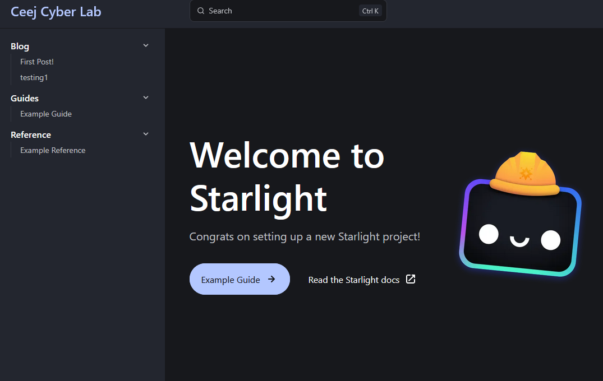
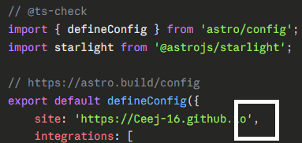

## Introduction

The inspiration for this blog came from a sysadmin at a previous job: Stuff gets lost if it's not written down so why not have my own place to think out loud, document, and share?

It seems appropriate that this first post is about how the setup process went for getting this site up and running. I leaned pretty heavily on Claude to get the repo set up and with how productive it was, I'll no doubt be doing more AI projects down the road and maybe even trying to integrate Claude into obsidian–Some TikToks might have influenced me on that... But really, this was a really fun first project—the back and forth with code, troubleshooting, and getting to a working site was really engaging to me.

## Why Starlight?

I had an old GitHub Pages site running Jekyll that I set up years ago following [this guide](https://jekyllrb.com/docs/pages/). It worked... okay. But it never quite flowed or looked the way I'd envisioned, and after letting it sit for so long, jumping back in didn't make sense. Starting fresh felt like the better move.

I started looking at Jekyll alternatives and came across Astro. I'd never heard of it before, but Starlight's pitch of "fast and easy-to-use" documentation sites caught my attention. The sidebar-based navigation was exactly what I wanted—clean, organized, and easy to navigate. Why not give it a shot?

I've never really imagined myself having a blog or putting stuff out publicly, but if I'm playing around with tech in my own time that also shows up at work, I might as well write it down and keep a record. The idea of looking back on this five years from now is genuinely exciting. Plus, having a wiki-style knowledge base is a nice bonus.

I don't consider myself a writer, but this is a fun way to flex those muscles alongside learning how to document and get this wiki going.

## The Setup Journey

### Installing Node.js on Windows

Downloaded Node.js from the official site and ran the installer with default settings. Everything seemed fine until I tried running `npm --version` in Command Prompt and got a PowerShell security error instead.

*The confusing error message that sent me down the wrong path.*

Turns out the error message was misleading - it was actually trying to run a PowerShell script when I thought I was in CMD. Switched to actual Command Prompt (not PowerShell) and npm worked fine.

*Facepalm - npm working correctly in actual Command Prompt.*

I forgot a while ago I set windows 11 to use PS as the default terminal instead of CMD...

### Getting the Project Running
Ran `npm create astro@latest` and got prompted with questions about templates and TypeScript strictness that didn't make any sense to me but just clicked through and chose the Starlight template, watched the installation run, and ended up with a folder full of unfamiliar files. Running `npm run dev` for the first time and seeing my website at `http://localhost:4321/` 

*Success!*

*Proof of an actual blog*

### Deploy Success... But 404?

Claude was super helpful in creating the workflow yaml file for github actions even calling me out for missing a comma in one line of the config causing the 404 and a failed deployment.

*The amount of headache that a single comma caused me...*

### The Sidebar That Wouldn't Populate

Created two blog posts in the `blog` folder, committed and pushed, watched the build succeed... and the sidebar showed nothing. The "Blog" section existed but was empty. Tested locally with `npm run dev` and the posts appeared fine. Eventually I discovered the issue was the date prefix in the filenames - `2026-04-09-first-post.md` from a template used back in my jekyll blog. It wasn't playing nice with Starlight's autogenerate feature. Removing the dates from the filenames, keeping them in frontmatter instead, and **voilà** the sidebar populated immediately. A filename convention that worked perfectly in Jekyll completely broke Starlight's expectations.

## What I Actually Learned About AI-Assisted Development

Going into this, I think my expectations for AI-Assistance were a little high. From prompt clarification to doublechecking work, I wasn't ready for the amount of hiccups and fixing that still needs my input throughout the process. I'll be curious how it goes in the future if I ever dip my toe into software development but that'll be another post for another day.

## What's Next

I was worried this blog project would turn Into a long writeup and I'm sure it's already there. In order to avoid the run on post, I'm going to make this a 3 parter. In the next post, I'll talk about my experience with Obsidian's Templater plugin—because manually writing frontmatter sounds about as fun as troubleshooting a printer (If you know, you know) and a finally a third post hoping to wrap it all up and look at what's next for Obsidian

## Related

- [GitHub Pages Setup Guide with Astro](src/content/docs/guides/Github-Pages-Setup-Guide-With-Astro.md)
