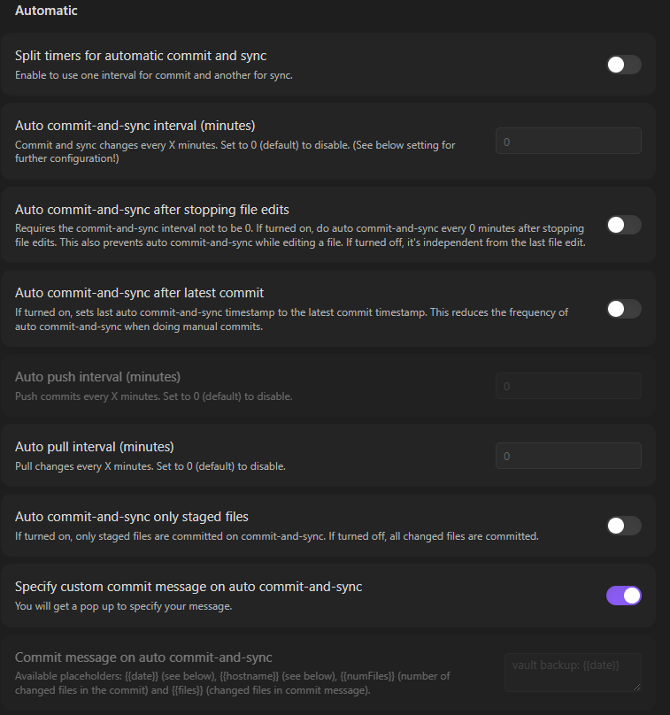
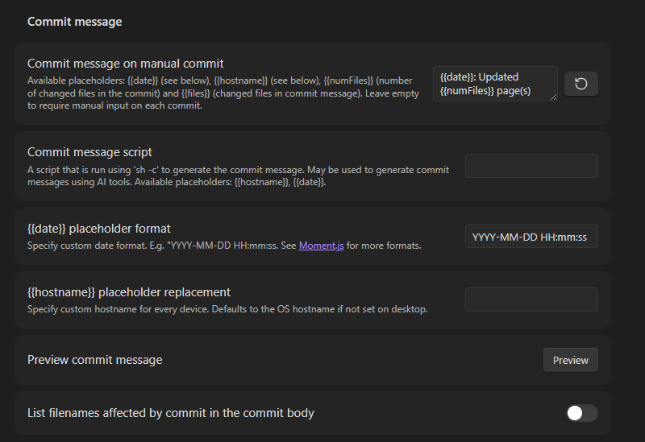
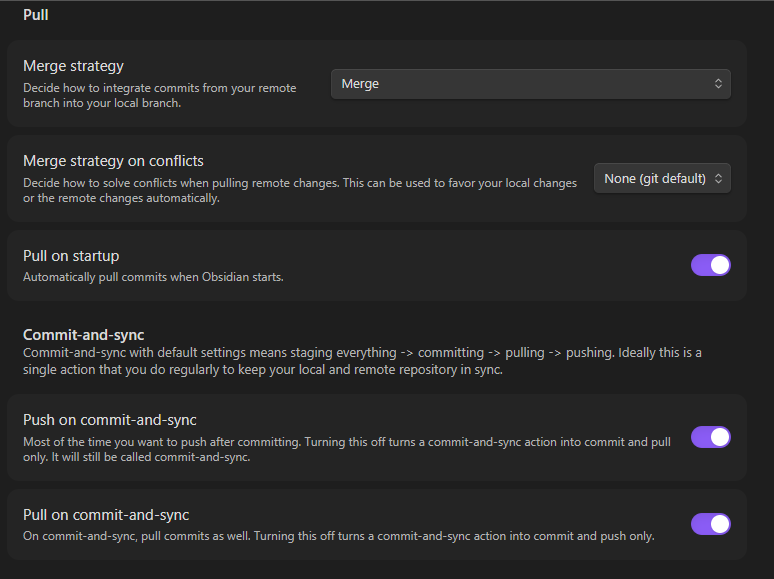

## Overview

This guide walks through building a GitHub Pages documentation site using Astro and Starlight, with Obsidian as your writing environment. The site will be hosted at `https://Ceej-16.github.io`.

### Tech Stack

- **Astro** — Static site generator
- **Starlight** — Documentation theme for Astro
- **GitHub Pages** — Free hosting
- **GitHub Actions** — Automated build & deploy pipeline
- **Obsidian** — Markdown editor for writing docs
- **Templater** (Obsidian plugin) — Auto-creates dated, properly structured doc files

### Prerequisites

- Node.js installed on your machine
- Git installed and configured
- A GitHub account
- Obsidian installed
- A terminal / Command Prompt

---

## Phase 1: Create the GitHub Repository

### Step 1: Create the Repository on GitHub

1. Go to [https://github.com/new](https://github.com/new)
2. Set the repository name to:

```
Your-Repo.github.io
```

3. Leave it **Public**
4. Do **NOT** initialize with a README (the Astro setup will handle this)
5. Click **Create repository**

> 💡 The repository name must exactly match your GitHub username followed by `.github.io` for the site to publish at the root URL.

---

## Phase 2: Scaffold the Astro + Starlight Project

### Step 2: Run the Starlight Installer

Open Command Prompt and navigate to your Documents folder:

bash

```bash
cd C:\Users\User\Documents
```

Run the Starlight creation command using your repo name as the folder name:

bash

```bash
npm create astro@latest Your-Repo.github.io -- --template starlight
```

When prompted, answer as follows:

- **Install dependencies?** → Yes
- **Initialize git repository?** → Yes
- **TypeScript strictness** → Relaxed (or Strict — either works)

> 💡 The installer may not ask for a site title. That is set manually in the config file in the next step.

### Step 3: Navigate into the Project

bash

```bash
cd Your-Repo.github.io
```

---

## Phase 3: Configure Astro for GitHub Pages

### Step 4: Edit `astro.config.mjs`

Open the config file in Notepad:

bash

```bash
notepad astro.config.mjs
```

Replace the entire contents with the following. Be careful with punctuation — **a missing comma will break the build**:

javascript

```javascript
// @ts-check
import { defineConfig } from 'astro/config';
import starlight from '@astrojs/starlight';

// https://astro.build/config
export default defineConfig({
  site: 'https://Your-Repo.github.io',   // <-- comma required
  integrations: [
    starlight({
      title: 'Title of your site',
      social: [{ icon: 'github', label: 'GitHub',
        href: 'https://github.com/Your-Github-Profile' }],
      sidebar: [
        {
          label: 'Guides',
          items: [
            { label: 'Example Guide', slug: 'guides/example' },
          ],
        },
        {
          label: 'Reference',
          autogenerate: { directory: 'reference' },
        },
      ],
    }),
  ],
});
```

> 💡 The most common build error is a missing comma after the `site` URL on line 6. Double-check before saving.

---

## Phase 4: Set Up GitHub Actions for Auto-Deploy

### Step 5: Create the Workflow File

Create the GitHub Actions directory and workflow file:

bash

```bash
mkdir .github\workflows
notepad .github\workflows\deploy.yml
```

Paste the following into `deploy.yml` and save:

yaml

```yaml
name: Deploy to GitHub Pages

on:
  push:
    branches: [ main ]
  workflow_dispatch:

permissions:
  contents: read
  pages: write
  id-token: write

jobs:
  build:
    runs-on: ubuntu-latest
    steps:
      - name: Checkout your repository using git
        uses: actions/checkout@v4

      - name: Install, build, and upload your site
        uses: withastro/action@v2

  deploy:
    needs: build
    runs-on: ubuntu-latest
    environment:
      name: github-pages
      url: ${{ steps.deployment.outputs.page_url }}
    steps:
      - name: Deploy to GitHub Pages
        id: deployment
        uses: actions/deploy-pages@v4
```

---

## Phase 5: Set Up Obsidian Vault

### Step 6: Open Project as an Obsidian Vault

1. Open Obsidian
2. Click **Open folder as vault** (or Open another vault → Open folder as vault)
3. Navigate to `C:\Users\User\Documents\Your-Repo.github.io`
4. Click **Open**

Your documentation content lives at:

```
src/content/docs/
```

All markdown files you create inside that folder will become pages on your site. You can organize them into subfolders — Starlight will automatically generate the sidebar from the folder structure.

### Step 7: Install the Templater Plugin

1. In Obsidian, go to **Settings → Community plugins**
2. Click **Browse** and search for **Templater**
3. Install and enable it
4. In Templater settings, set the **Templates folder location** to a folder like `Templates`

### Step 8: Create the Doc Template

Create a new note at `_templates/new-doc.md` with this content:

```
<%*
const hasTitle = !tp.file.title.startsWith("Untitled");
let title;

if (!hasTitle) {
  title = await tp.system.prompt("Enter Note Name");
  if (!title) return;
} else {
  title = tp.file.title;
}

// Prompt for folder/category
// You can update this system prompt with new folders for easy reference or just type in the folder you want
const folder = await tp.system.prompt("Folder (blog/guides/reference)");
if (!folder) return;

// Create slug from title (no date prefix)
const slug = title.toLowerCase()
  .replace(/[^\w\s-]/g, '')
  .replace(/\s+/g, '-');

// Get today's date for frontmatter
const date = tp.date.now("YYYY-MM-DD");

// Move and rename (just the slug, no date)
await tp.file.move(`src/content/docs/${folder}/` + slug);
_%>

---

title: <% title %>
description: <% title %>
date: <% date %>

---

## Overview

Add content
```

This template will:

- Prompt you for which template to use
- Prompt you for the note name
- Prompt you for which folder in `src/content/docs/`
- Move the file into `src/content/docs/`
- Insert the correct frontmatter

---

## Phase 6: Push to GitHub and Enable Pages

### Step 9: Add `.gitignore`

Make sure your `.gitignore` includes Obsidian config files. Open or create `.gitignore` in the project root and ensure it includesat a minimum the obsidian files and .astro. Beyond that I haven't played around with what's wrapped up in the other items but it's working now so I may come back to this in the future with a better reason. I excluded my templates as well as a catch-all doc for post ideas and the like:

```
# build output
dist/
# generated types
.astro/

# dependencies
node_modules/

# logs
npm-debug.log*
yarn-debug.log*
yarn-error.log*
pnpm-debug.log*


# environment variables
.env
.env.production

# macOS-specific files
.DS_Store

# Obsidian specific files
.obsidian/
.trash/
Templates/
Blog Post Ideas/
```

### Step 10: Commit and Push

Run all git commands from inside `C:\Users\User\Documents\Your-Repo.github.io`:

bash

```bash
git add .
git status
git commit -m "Initial Starlight site setup"
git remote add origin https://github.com/Your-Github/Your-Repo.github.io.git
git branch -M main
git push -u origin main
```

GitHub will prompt you to authenticate via a browser window. Once pushed, the GitHub Actions workflow will trigger automatically.

The community plugin Git is also worth looking into if like me, you don't want to open a separate CMD to commit and push every time. The plugin let's you set a ton of customizations within obsidian to handle one button commit and sync as well as timed backups if that's more your style.

My process looks like this assuming your first commit was from CMD:

Install the Plugin
1. **In Obsidian**, open Settings (gear icon)
2. Go to **Community plugins**
3. If "Restricted mode" is on, turn it off
4. Click **Browse**
5. Search for **"Obsidian Git"**
6. Click **Install**, then **Enable**

Configure Obsidian Git
1. Go to **Settings → Obsidian Git**
2. Configure the following settings to use a manual commit (I want to keep each working session as its' own commit for now but nothing wrong with setting automated backups):



### Step 11: Enable GitHub Pages in Repo Settings

1. Go to your github repo containing the blog
2. Click **Settings → Pages**
3. Under **Source**, select **GitHub Actions**
4. Save

After the first successful workflow run, your site will be live at:

```
https://Ceej-16.github.io
```

---
## Day-to-Day Writing Workflow

Once everything is set up, your workflow for adding new documentation is:

1. Open Obsidian to your `Your-Repo.github.io` vault
2. Use the Templater shortcut (I use Alt + N) to create a new doc from your template
3. Enter the note name when prompted
4. Enter the destination folder if more than one
5. Write your content in Obsidian
6. Use whatever hotkey you have set for commit-and-sync or use the button in the top right toolbar
7. GitHub Actions builds and deploys automatically within ~1 minute

> 💡 You can also run `npm run dev` locally to preview your site at `http://localhost:4321` before pushing.

---

## Related

- [Setting up the Blog](/blog/Setting-up-the-Blog.md)